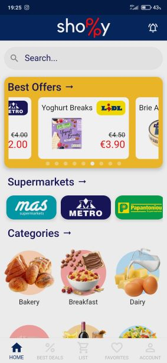
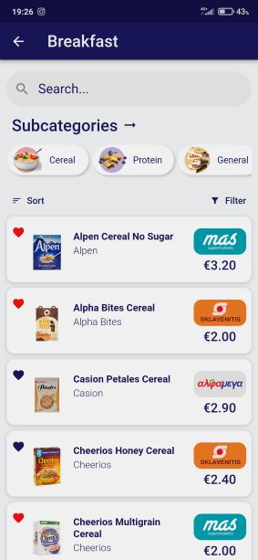
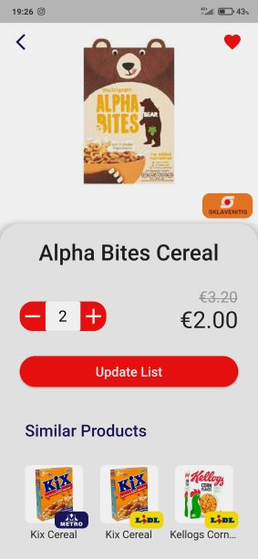
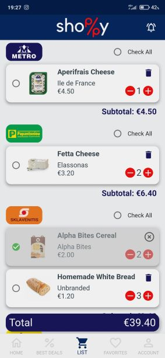
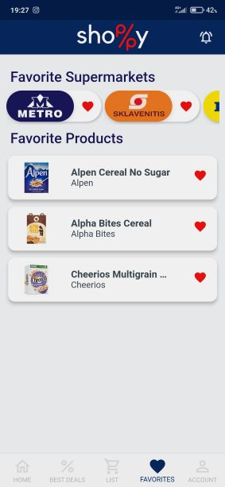
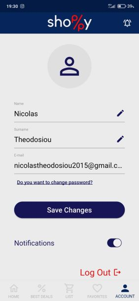

# Shoppy

Shoppy is a  Flutter application designed to streamline the process of finding supermarket discounts. It organizes discounts in a clear, accessible manner, allowing users to browse deals with ease and efficiency.

## Features

- **Organized Display:** Discounts are neatly displayed, making it easy for users to find what they are looking for without hassle.
- **Browse by Category or Supermarket:** Users can view deals by specific categories or supermarkets, making the shopping experience easier.
- **Advertisements:** The top part of each page displays advertisements, contributing to the app's revenue model.
- **Deal Comparison:** Shoppy allows users to compare deals across different stores, ensuring they get the best value.
- **Save for Later:** Users can save deals to a personalized list, which can be accessed during their next shopping trip.

## Homescreen

  
  

## Product Screen

  

## Cart and Favorites

  
  

## Account Screen

  

